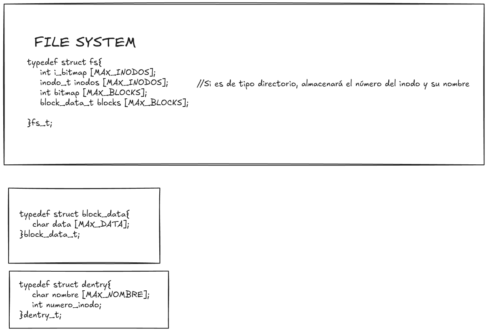
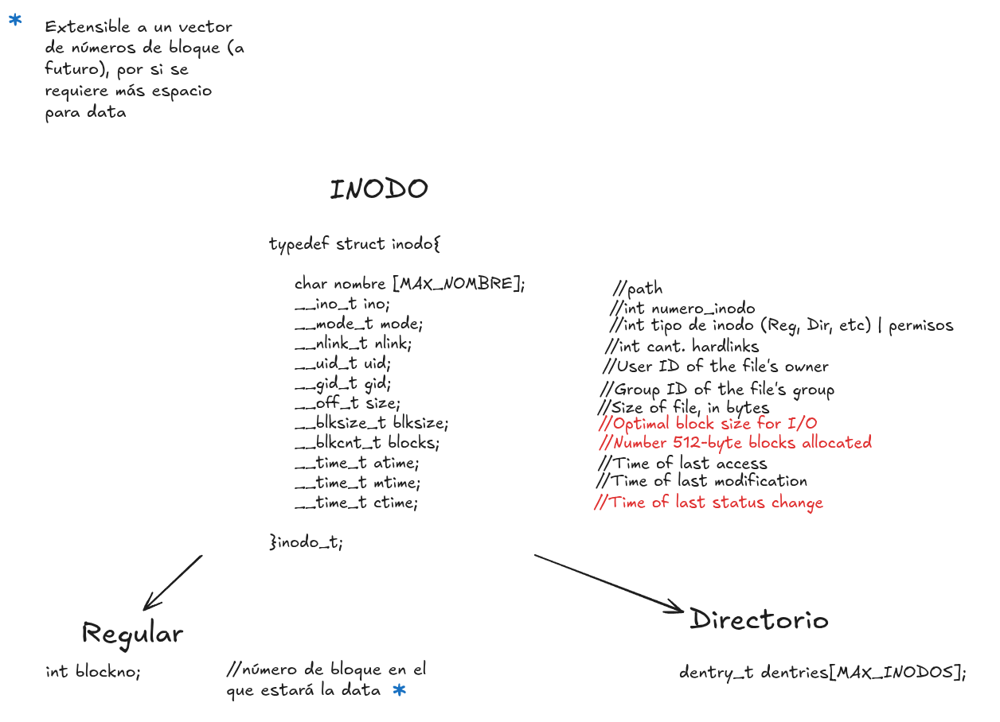
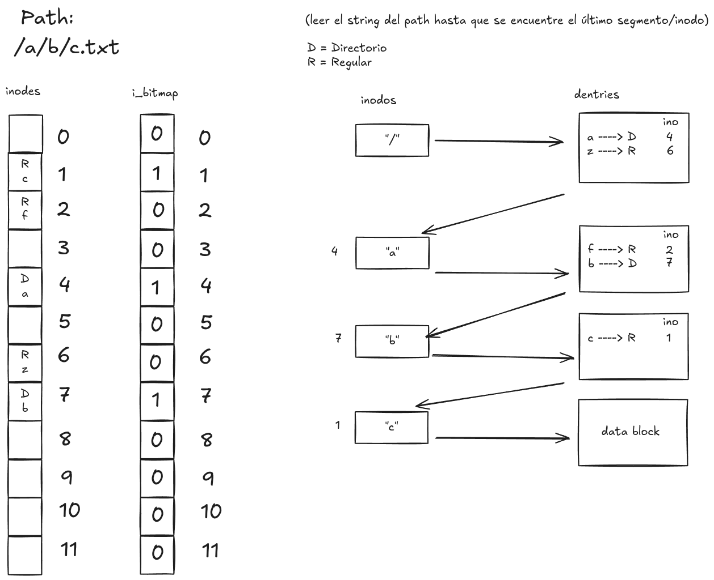

# fisop-fs

Aspectos de diseño:

## * Estructura general:
Se decide adaptar la idea de un VSF (very simple file system) al programa propuesto, en el que dicho file system es conformado por: 
- Inodos (inodo_t)
- Bloques de datos (data_block_t)
- I bitmap (i_bitmap_t)
- D bitmap (d_bitmap_t)

La estructura global es representada por el file_system_t.

## * Estructuras en memoria que almacenarán los archivos, directorios y sus metadatos:

- ###  **File system (file_system_t):**
Es donde confluye toda la información del sistema, se estableció como una variable de tipo global, y por medio de la cual se tendrá acceso a los inodos, bloques de datos y respectivos bitmaps.



- ### **Inodos (inodo_t):**
Se plantea un vector de estructuras de tipo inodo_t, cuya información contenida es la metadata del archivo/directorio al que hace referencia; si el inodo es de tipo **_archivo_**, entonces, poseerá el número de bloque que le corresponde, el cual tiene almacenada toda la información y datos respectivos (actualmente se maneja con un sólo bloque de datos, pero el diseño puede ser escalable a un vector de bloques de datos). Si el inodo es de tipo **_directorio_**, este tendrá un vector de tipo dentry_t, el cual indicará los distintos inodos que pertenecen a dicho directorio (por medio de sus números de inodo). Algunos de los campos que componen al inodo (metadata), son: nombre del inodo (archivo/directorio), numero de inodo, tipo de inodo (**__S_IFDIR*** o **__S_IFREG**, cada modo acompañado de su respectivo permiso), cantidad de hardlinks que posee (por lo general si es de tipo directorio posee al menos dos y si es de tipo archivo contiene al menos 1), user ID, group ID, tamaño actual del archivo al que redirige, cantidad de bloques de memoria que se encuentra utilizando, fecha de último acceso y fecha de última actualización. 



- ###  **Bloques de datos (block_data_t):** 
Actualmente se estipula la cantidad máxima de bloques (MAX_BLOCKS) a partir del tamaño total que se desee que tenga el file system dividida por el tamaño que tenga cada bloque de datos (MAX_DATA), de forma tal que MAX_BLOCKS sea un entero; ambas serán constantes que se encuentran configuradas como un "#define" en el archivo .h del TDA del file system.

La cantidad de inodos tiene una relación uno a uno con la cantidad de bloques de datos, sin embargo, se podría llegar a escalar esta implementación para que cada inodo pueda llegar a tener la cantidad de bloques de memoria que requiera.

- ###  **I bitmap (i_bitmap_t):**
Es un vector de enteros en el que cada una de sus posiciones señala el número de un respectivo inodo, con lo cual 0 índica que el inodo se encuentra sin uso y 1 que dicho inodo se encuentra activo.

- ###  **D bitmap (d_bitmap_t)**
Es un vector de enteros en el que cada una de sus posiciones señala el número de un respectivo bloque de datos, con lo cual 0 índica que el bloque de datos se encuentra sin uso y 1 que dicho bloque de datos se encuentra siendo utilizado por algún inodo.


## * Cómo el sistema de archivos encuentra un archivo específico dado un path:



La idea general de búsqueda de un archivo/directorio se basa principalmente en tres cosas, la primera es que si el inodo actual consultado es de tipo directorio, el mismo tiene como uno de sus campos un vector de estructuras de tipo "dentry_t", dicha estructura almacena el número del inodo (ino) y el nombre del archivo/directorio; la segunda y tercer cosa en la que se apoya la búsqueda del respectivo path es en el número del inodo como tal y el número del respectivo bloque de datos, cada uno de estos números realmente actúan como índices de búsqueda en el vector de inodos y en el vector de bloques de datos, con lo cual de forma relativamente sencilla se logra una búsqueda para un path con n cantidad de archivos de anidación.

La búsqueda como tal empezaría siempre por la raíz del file system, teniéndose como convención que posea el indice 0 de inodo y que sea por supuesto de tipo directorio (por lo cual posee un vector de dentries), se procede a seleccionar el primer segmento (el primer archivo del path recibido), verificando si el mismo se encuentra dentro del vector de dentries del directorio actual, si no se encuentra se devuelve el respectivo error, y caso contrario se procederá a buscar a partir de su número de inodo el correspondiente inodo dentro del vector de inodos del file system, corroborando que si no es el último archivo del path, entonces deberá de ser de tipo directorio (sino devolverá error), y así sucesivamente se genera la busqueda hasta llegar al último segmento del path o último archivo/directorio, devolviendo el correspondiente número de inodo a quien haya invocado a la respectiva función de búsqueda (find_ino_from_path).

## * Todo tipo de estructuras auxiliares utilizadas
- **dentry_t**:

Como se mencionó anteriormente, está conformado por el nombre de un inodo y su respectivo número (índice dentro del vector de inodos)

- **block_data_t**:

Almacena el contenido de la información del archivo.

## * El formato de serialización del sistema de archivos en disco:

Se decidió realizar una implementación de estructuras y datos estáticos (desde un principio definidos en file_system.h), y contenidos dentro de una estructura general "file_system_t", para que de esta manera fuese mucho más fácil y de forma prácticamente directa tanto el almacenamiento de dicha estructura como su recuperación al momento de iniciarse de nuevo el programa, con lo cual tanto serialización como deserialización se trata de una escritura y lectura directa de bytes sin ningún manejo intermedio de tamaños o algo por el estilo. La lectura se realiza una vez se inicializa el programa (desde fisopfs_init) y de existir previamente un archivo creado (de lo contrario se creará por primera vez el file_system_t), y la respectiva escritura se realiza en dos momentos del flujo del programa, el primero cuando se llame a la función "fisopfs_flush" y/o cuando "fisopfs_destroy" sea llamada, generando la respectiva persistencia sobre el archivo definido desde un principio.

## * Tests sobre el filesystem:
Para la sección de los tests decidimos incluir un programa en Python con tests de tipo *table‑driven*, donde cada test se basa en la siguiente estructura:

- Dos archivos de texto (`err.txt` y `out.txt`) para representar `stdout` y `stderr` durante el test. Estos se guardan en la carpeta `received_output`.
- Un script de shell que se ejecuta y va poblando dichos archivos mientras avanza el test (por ejemplo, usando redireccionamientos de `ls`, `cat`, el error de `mkdir`, etc.).
- Una carpeta `expected_output` donde cada test define una subcarpeta con el nombre del test (`test_name`), que contiene los archivos de salida esperada (`out.txt` y `err.txt`).
- Una función que compara los archivos `out.txt` y `err.txt` de `expected_output` con los de `received_output`. En caso de falla, los archivos en `received_output` se conservan para facilitar el diagnóstico.
- Dos funciones, `setup` y `cleanup`:
  - `setup` inicializa el sistema de archivos antes del test.
  - `cleanup` lo elimina después.
  para garantizar un entorno esteril y preservar`prueba` como *la* carpeta del filesystem.

La forma mas consistente (y recomendada) de ejecutar los test es desde docker. Desde el mismo `docker run`, nos vamos a la carpeta test y ejecutamos `python3 test.py` esto imprimira en la terminal el resultado de todos los test.

## * Cualquier otra decisión/información que crean relevante:

En general se decidió implementar un TDA que defina y encapsule la estructura del file system como tal, en la cual se puede crear dicho file system, realizar la respectiva actualización de los inodos, de los bloques de datos, bitmaps y demás; encargandose del manejo de la búsqueda del correspondiente inodo según el path suministrado.

### Prueba de archivo binario:
Se decide agregar una funcionalidad de **display** para imágenes, como manera de comprobar la persistencia de un archivo binario.
La manera de ejecutarlo se encuentra definido en el README.md (sección: Prueba de archivo binario).
Para lo cual se agrega **feh**, el cual es un visor de imágenes, realizando algunas modificaciones en el archivo **.dock** y **dockerfile**:

```c


    xhost +local:docker  # Permitir conexiones del contenedor al X server del host

    # Ejecutar el contenedor con X11 forwarding
    $DOCKER $RUN_CMD -it --rm --name="$CONTAINER_NAME" \
        -v "$PWD":/fisopfs \
        -v /tmp/.X11-unix:/tmp/.X11-unix \      # socket X
        -e DISPLAY="$DISPLAY" \                 # variable DISPLAY
        --device /dev/fuse \
        --cap-add SYS_ADMIN \
        --security-opt apparmor:unconfined \
        "$IMAGE_NAME" bash

    
    xhost -local:docker    # Revoca el acceso al servidor X cuando termine
```

Lo cual debido a que se está intentando abrir una ventana gráfica (GUI) desde un container de Docker, lo anterior permite que dicho container 
pueda hacer uso de un servidor gráfico para realizar el respectivo display.

De esta forma la manera de realizar el display de una imagen que se encuentre en el file system y probar tal vez antes y después de la persistencia
sería, estando en el directorio que contiene a dicha imagen (.png, .jpg, .gif) y ejecutando en la terminal:

```bash
$ feh nombre_archivo.png
```
