# sched

En este trabajo se implementarán el mecanismo de **cambio de contexto** para procesos y el **scheduler** (i.e. planificador) sobre un sistema operativo preexistente. 

El kernel a utilizar será una modificación de JOS, un exokernel educativo con licencia libre del grupo de Sistemas Operativos Distribuidos del MIT.

JOS está diseñado para correr en la arquitectura Intel x86, y para poder ejecutarlo utilizaremos QEMU que emula dicha arquitectura.

## Context Switch 
En la función `env_run` llamamos a la función `context_switch` implementada en código Assembly pasándole por parámetro el puntero al Trapframe de `env`, el parámetro pasado es pusheado al Stack. Ademas, `call` pushea automáticamente el return address que quedará en el tope del Stack. 

La función `context_switch` en Assembly, para acceder al parámetro pasado, debe cargar en `esp` el valor apuntado por `[esp + 4]`, ya que, no realizamos, `ret` (necesita el return address para volver) al finalizar, sino `iret`. 

Por lo tanto, la primera instrucción ejecutada es `movl 4(%esp), %esp`.  Esta instrucción  reemplaza el valor de `esp` por el contenido de la dirección `[esp + 4]`, que corresponde al puntero del stack del nuevo entorno (`Trapframe`).

Antes de ejecutar la instrucción, el valor de `esp` es `0xf011efbc`.  
El contenido en esa dirección (`[0xf011efbc]`) es `0xf0103468`, y en la dirección siguiente (4 Bytes más adelante `[0xf011efc0]`) se encuentra el valor `0xf02c8000`, que es el nuevo valor que se cargará en `esp`.

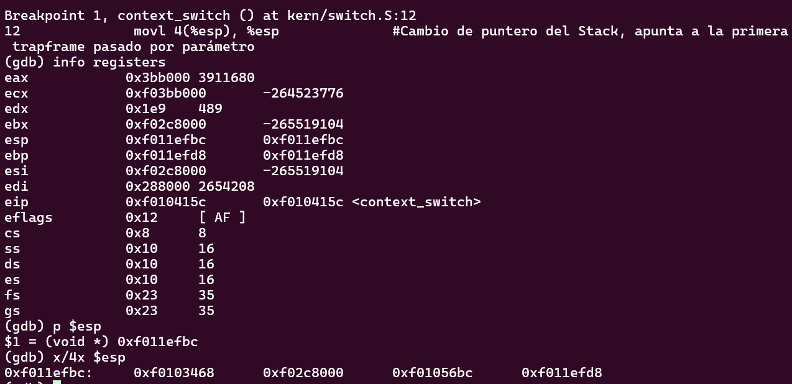

Después de ejecutar `movl 4(%esp), %esp`, observamos que el nuevo valor de `esp` es efectivamente `0xf02c8000`.

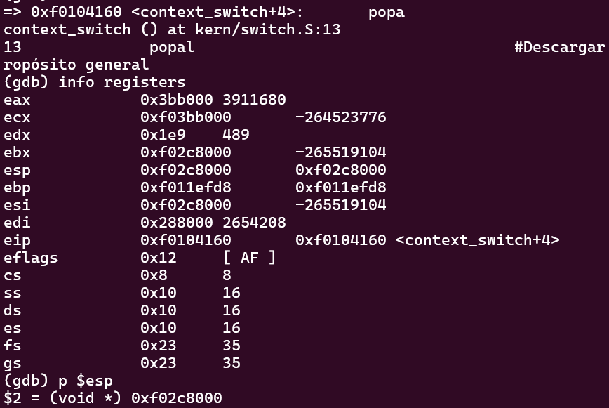

A continuación se ejecuta la instrucción `popal`, la cual restaura el estado de los 8 registros generales (PushRegs): `edi`, `esi`, `ebp`, `esp` (ignorado), `ebx`, `edx`, `ecx`, y `eax`, en ese orden.

Obeservamos que después de la instrucción `popal` todos los registros PushRegs se vuevlen 0. Los valores son cargados a los registros correspondientes. 

Esto implica que el stack pointer (`esp`) se desplazará 32 bytes (8 registros × 4 bytes).

Son 8 registros en PushRegs por lo que `esp` se desplazará `4 Bytes * 8 = 32 Bytes = 0x20` desde la dirección `0xf02c8000`. 

Si hacemos la suma `0xf02c8000 + 0x20 = 0xf02c8020` 

Y efectivamente, al observar el valor actualizado de `esp`, coincide con ese cálculo.

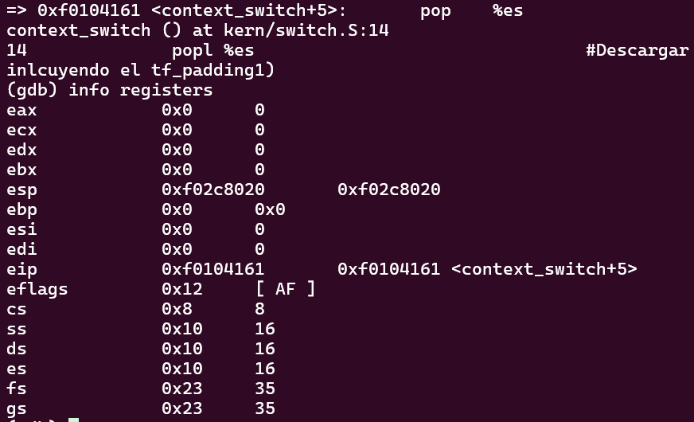

Luego, se ejecutan las instrucciones: `popl %es` y `popl %ds`.

Estas restauran los registros de segmento `es` y `ds`. Al examinar la pila con `x/4x $esp`, podemos confirmar los valores que serán cargados en estos registros. En este caso, el valor `0x23` es cargado correctamente en ambos:

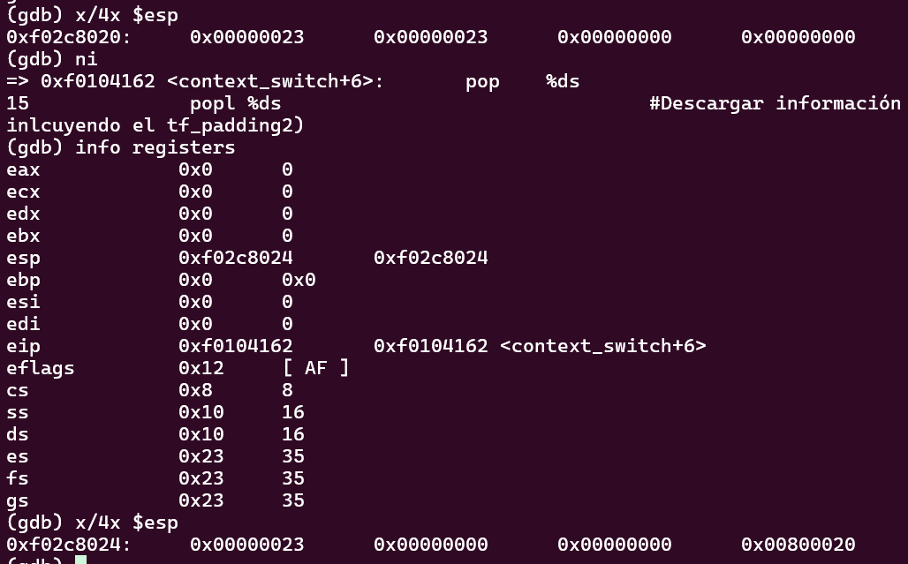

`esp` se incrementa en 8 bytes más, avanzando desde `0xf02c8020` hasta `0xf02c8028`. En la próxima instrucción `addl $0x8, %esp` le estaremos sumando 8 bytes a la dirección `0xf02c8028` para saltear los campos `trapno` y `err`. 

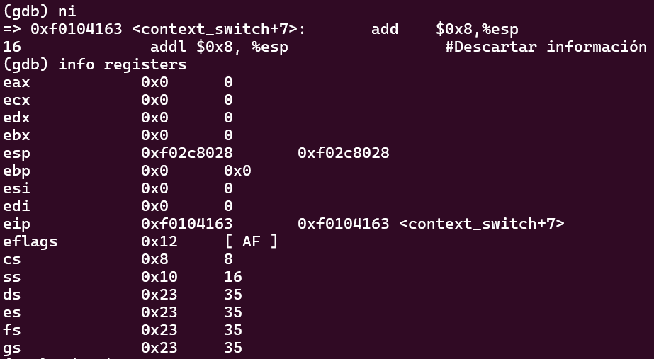

Observamos que haciendo `0xf02c8028 + 0x8 = 0xf02c8030` nos da efectivamente la dirección en `esp`. 

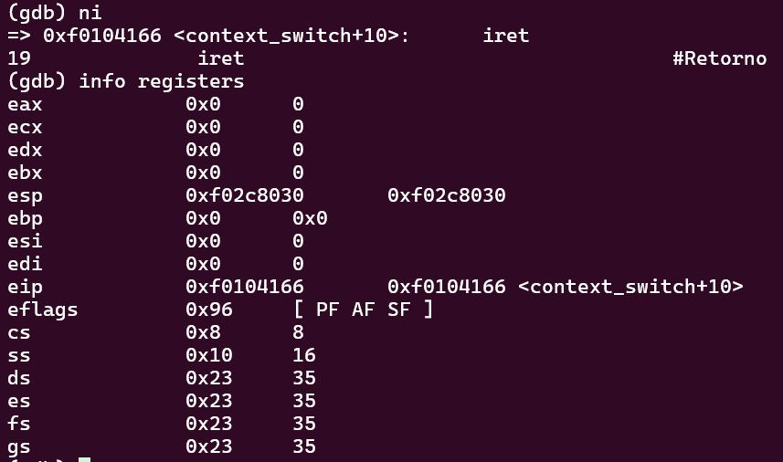

Finalmente, se ejecuta la instrucción `iret`, que restaura los valores de `eip`, `cs` y `eflags`.

Al observar el valor del registro `cs`, vemos que cambia de `0x08` (modo kernel, Ring 0) a `0x1b` (modo usuario, Ring 3), lo que confirma que se realizó correctamente el cambio de contexto desde un entorno en modo kernel a uno en modo usuario.

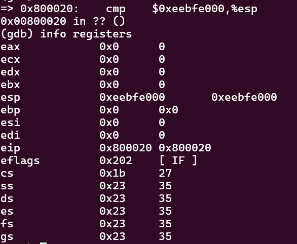


# Scheduler de prioridades:

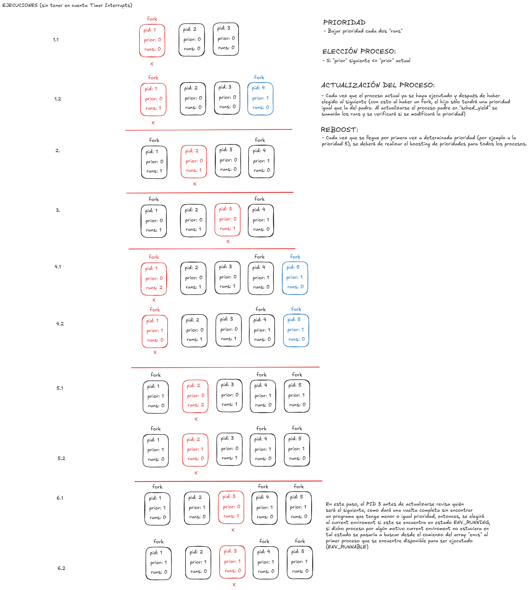

La idea es elegir el primer elemento más próximo con mejor o igual prioridad que la del proceso que estuvo en ejecución (ENV_RUNNING), de no haber ningún programa que cumpla dicha condición, significa que no hay más procesos con dicho nivel de prioridad (exceptuando tal vez al _current enviroment_, curenv), con lo cual se procederá a elegir el proceso que se ejecutó de último (curenv) si este se encuentra en estado ENV_RUNNING, de lo contrario se intentará buscar al primer elemento dentro del array "envs" (sin importar su prioridad, la única condición es que sea ENV_RUNNABLE), y de no existir ningún programa con dicha condición, y si nada de lo anterior se llegó a cumplir se realizará un llamado a "sched_halt"

## Decremento de Prioridad
Si la cantidad de corridas (env_runs) de un determinado proceso fuese mayor o igual que MAX_RUNS (dicha variable podría ser modificable de 0 a N, tomando como 0 la mejor prioridad y N la peor), reseteamos la cantidad de corridas a 0 y le bajamos la prioridad. 
En caso de que un proceso realice fork, el proceso Hijo se crea con una prioridad igual que la del Padre. 

## Reboost 
Cada vez que la cantidad de corridas (env_runs) sea mayor o igual a MAX_RUNS y su prioridad alcance o sobrepasa MAX_PRIOR_DEPTH se realiza el Reboost en el que se recorre todos los procesos en ‘envs’ y se resetea la prioridad de todos a la mejor prioridad (prioridad 0). De esta manera evitamos que algunos procesos caigan en *Starvation*.

## Prueba de priorities:

Las siguientes son las constantes que se tuvieron en cuenta para realizar la ejecución del scheduler de prioridades, en la que se tiene establecido que cada vez que el proceso corra una vez se decremente la prioridad del mismo (MAX_RUNS == 1), y luego se tiene la cantidad máxima de ejecuciones que tiene que presentar un proceso antes de que se realice un reboost (MAX_PRIOR_DEPTH == 6) 

```c

#define MAX_RUNS 1 
#define MAX_PRIOR_DEPTH 6


```
El siguiente es el programa ejecutado para llevar a cabo la prueba de cambio de prioridades, en la que se elige el PID del proceso actual (el PID que se destinó en un comienzo en init para dicho proceso), luego para este se revisa la cantidad de prioridades que se tiene en determinado momento, se empeora la prioridad en 2, se otiene la prioridad actual del proceso, seguido de un nuevo decremento pero esta vez en 1, y una última verificación de que el valor obtenido para la priodidad de dicho proceso sea consistente con todos los cambios que se le aplicaron a dicha variable:
```c
#include <inc/lib.h>

void
umain(int argc, char **argv)
{
    envid_t env = sys_getenvid();

    while (1) {
        cprintf("I am the current env de ID: %e ...\n", env);
        cprintf("My priority is %d\n", getpriority(env)); 
        cprintf("Decreasing...\n"); 
        decpriority(env, 2); 
        cprintf("Decreasing priority of the curenv. My priority now is %d\n", getpriority(env)); 
        cprintf("Decreasing...\n"); 
        decpriority(env, 1); 
        cprintf("Decreasing priority of curenv. My priority now is %d\n", getpriority(env)); 
        sys_yield(); 
    }
}
```


En las siguientes imágenes se puede ver cómo se intercalan las distintas ejecuciones de 3 procesos (hello, primes y priorities), y cómo con el scheduler de prioridades se generan una distribución de ejecución adecuada entre estos

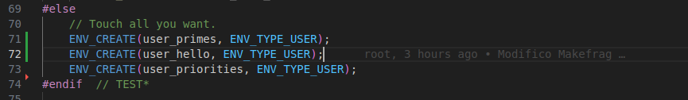


Para el caso de primes se observa cómo aparecen los primeros números primos (2 y 3), se imprime correctamente un "hello world" y se modifican los valores de las prioridades del proceso de priorities.

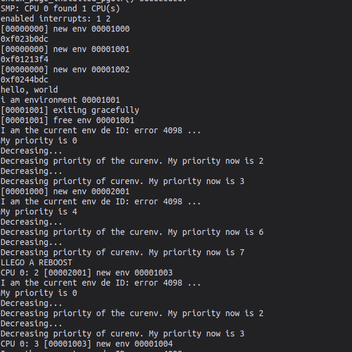

## Comportamientos observados durante la ejecución

Durante el desarrollo notamos algunas inconsistencias con respecto a dos casos
particulares:

### 1) Sobre la impresion de las estadisticas:

Al trabajar sobre imprimir las estadisticas del scheduler nos encontramos con la indicacion de donde las estadisticas deberian ir segun los comentarios de JOS.


Al colocarlas ahi, nos dimos cuenta que nunca se llegaban a imprimir gracias al llamado que se hace al JOS_monitor, que segun los mismos comentarios seria por debug/test.

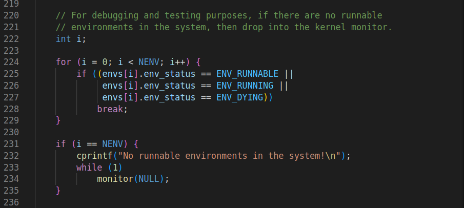

A lo que decidimos comentar este monitor y dejar las estadisticas donde indicaba, pero hacer esto terminaba llevando a un loop infinito del programa repitiendose desde 0. Para evitar esto y poder ver las estadisticas decidimos colocar los prints antes del monitor y dejar este activo.


### 2) Inestabilidades con cprintf:

Al ejecutar las pruebas con 'make grade' notamos que si utilizabamos cprintf a forma de debug dentro de la funcion 'sched_yield()' esto generaba inestabilidades en el resultado de las pruebas, tanto para round robin como el scheduler con prioridades.

Tuvimos ejemplos donde el test primes tenia ejecuciones intermitentes entre pasar el test con 3/4 segundos, a dar timeout directamente. A su vez, dentro de round_robin, previo a sumar las estadisticas, los test eran completamente estables pero sumando la actualizacion de estadisticas el test 'stresssched' daba resultados intermitentes entre pasar en 0.6s y pasar en 30.8/30.9s, a pesar de probarlo repetidas veces el comportamiento se mantenia entre los dos valores, sin hacer cambios entre ejecuciones.

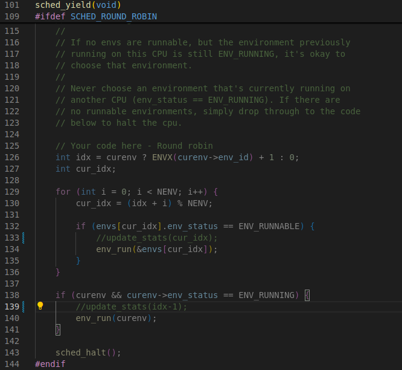

Estas diferencias se daban en test puntuales y no parecian afectar otros test. Aun asi, decidimos dejar las estadisticas incluidas.
