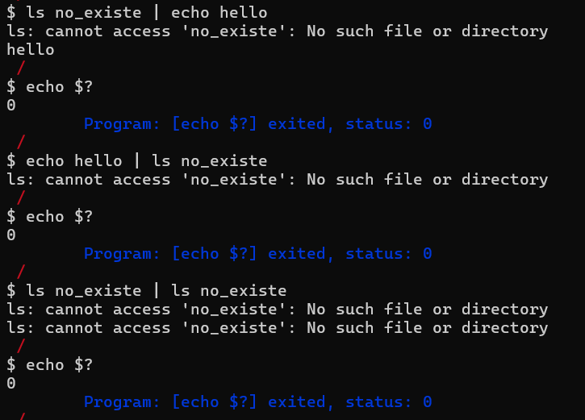
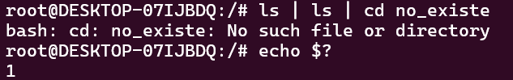
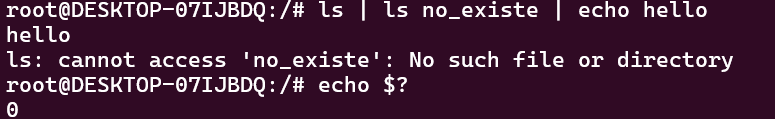
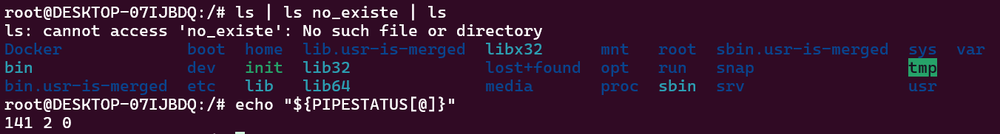
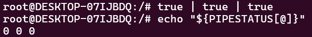
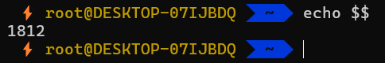
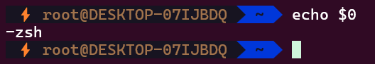
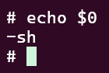
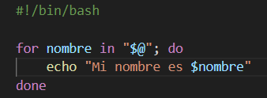
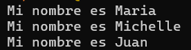

# shell

## Búsqueda en $PATH
### ¿Cuáles son las diferencias entre la syscall execve(2) y la familia de wrappers proporcionados por la librería estándar de C (libc) exec(3)?

Básicamente la gran diferencia entre la syscall **execve(2)** y los wrappers de la biblioteca estándar de C es que la primera será que estos últimos proveen de distintas maneras formas más "simples" / convenientes de llevar a cabo el mismo resultado (pues a fin de cuentas la llamada última que cada uno de dichos wrappers realizará para ejecutar el respectivo cambio de proceso, será con la syscall execve(2)). 

De esta forma se tiene que es execve(2) la que invoca al kernel para que cargue al nuevo proceso, en cambio los respectivos wrappers son simplemente unos intermediarios que sirven de antesala para dicho procedimiento.

execve(2) no busca en $PATH, por lo que se debe pasar la ruta del binario para que este la ejecute; de otro lado, se tiene que hay wrappers que no requieren que les sea pasado el path específico al binario, sino simplemente con el nombre del archivo es suficiente, estos buscan en $PATH a la respectiva ruta y la reemplazan antes de enviar a ejecutar a execve(2).

```c
#include <unistd.h>

       int execve(const char *pathname, char *const _Nullable argv[],
                  char *const _Nullable envp[]);

```
execve(2) es invocada para realizar el cambio de un proceso a otro, además inicializa un nuevo stack, heap y un nuevo segmento de datos. 

El **pathname** será un binario ejecutable o un script del mismo.

**argv** será un array de punteros a string pasados para el nuevo programa como sus argumentos de línea de comandos. Por convención el primero de ellos "argv[0]" tendrá que ser el nombre del archivo asociado con el archivo a ser ejecutado. Dicho array deberá de tener como último argumento un puntero a NULL.

**envp** es un array de punteros a strings, de la forma "KEY==VALUE", los cuales son pasados como entorno del nuevo programa, dicho array deberá de terminar con un putero a NULL.

Hay distintas formas de llevar a cabo este cambio entre procesos, siendo algunas más específicas que otras o más "directas" que otras, cada una dependiendo de la necesidad que se tenga para tal fin, con lo cual se puede encontrar por ejemplo la que se utiliza en este TP, "execvp", esta requiere únicamente de dos parámetros, el primero puede ser ya sea el binario (path absoluto o relativo), o simplemente el nombre del archivo al que hace referencia el mismo, el cual hace uso de busqueda de archivos del PATH con lo que no necesita de un path exacto para buscar el programa a ejecutar; después, su segundo parámetro será un array con los argumentos que utilizará dicho programa como sus argumentos de línea de comandos, iniciando por el nombre del archivo y terminando con un puntero a NULL (cabe destacar que no requiere de un tercer parámetro).

### ¿Puede la llamada a exec(3) fallar? ¿Cómo se comporta la implementación de la shell en ese caso?
Si, puede ocurrir que no se pueda ejecutar el nuevo proceso, con lo cual se emitirá el respectivo error a partir de un "perror()", y se procederá a salir del proceso actual con un "exit(EXIT_FAILURE)"

## Procesos en segundo plano

### ¿Por qué es necesario el uso de señales?
Porque es una de las formas más eficientes y directas de comunicación entre procesos, haciendose esto último necesario debido a que la memoria entre procesos no es compartida y por lo tanto esta es una buena manera de conocer la ocurrencia de un evento en un proceso desde cualquier otro que quiera recibir y manejar dicha información. En el caso puntual del presente TP fue vital su uso ya que se permitió recibir información acerca de un determinado evento para poder actuar conforme a lo que este informaba; más específicamente se permitía implementar una especie de handler para el manejo del evento en el cual terminara su proceso alguno de los hijos del proceso original (proceso shell), gracias al flag SIGCHLD (en sigaction), con esto y a partir del listener que se tenía en dicho proceso, se podía coordinar dicha captura de finalización de procesos en background por más que fueran procesos distintos en los que estaban ocurriendo los eventos.

En general existen distintos tipos de señales, las cuales se encuentran numeradas y están diseñadas con fines específicos, pero en general cada una está creada para actuar como aviso de un determinado evento.

## Flujo estándar

### - Investigar el significado de 2>&1, explicar cómo funciona su forma general
Lo que indica la anterior redirección es que la salida de error (de existir este) deberá de ser la misma que la indicada en el file descriptor "1"; por lo general cuando esto ocurre es porque tal vez el file descriptor 1 fue redireccionado a un lugar distinto que la salida standar (stdout), con lo cual la salida de error será dirigida al mismo sitio.

### - Mostrar qué sucede con la salida de cat out.txt en el ejemplo.
Salida para el redireccionamiento de salida standar (forma general):


Salida para el redireccionamiento del error:


### - Luego repetirlo, invirtiendo el orden de las redirecciones (es decir, 2>&1 >out.txt). ¿Cambió algo? Compararlo con el comportamiento en bash(1).


En general ambas líneas de comando generan la misma salida, pero esto es debido a como funciona la lógica del redireccionamiento en esta shell, en la que se deducen las redirecciones a archivos según si el campo destinado para determinado tipo de archivo se encuenta vacío o no.
```c
    char out_file[FNAMESIZE];
	char in_file[FNAMESIZE];
	char err_file[FNAMESIZE];
```
Esto conlleva a que claramente no haya distinción entre que la salida standar sea redirigida a un archivo y luego la salida de error pueda ser redirigida al mismo archivo (lo cual ocurriría generalmente por ejemplo en bash con: ls >out.txt 2>&1); y que se desee hacer que la salida del error sea redirigida al stdout y luego que el fd del stdout pueda ser redirigido a algún archivo (como es el caso de ls 2>&1 >out.txt), por lo que en la shell del presente TP no hay una diferencia entre estos dos casos y como se vio anteriormente generan por el contrario el mismo resultado.

## Tuberías múltiples

---
#### ¿Qué ocurre con el exit code reportado por la shell si se ejecuta un pipe? ¿Cambia en algo?

#### ¿Qué ocurre si, en un pipe, alguno de los comandos falla? Mostrar evidencia (e.g. salidas de terminal) de este comportamiento usando bash. Comparar con su implementación.

En nuestra implementación, el exit code por la shell cuando se ejecuta un pipe es siempre 0 (EXIT_SUCCESS), independiente de si falló la ejecución de algún comando y en qué comando falló. 

En nuestra implementación, no importa en qué proceso falló y en dónde falló siempre el exit_code es 0. 



En cambio, en Bash para el caso de pipes anidados, Bash solamente guarda el exit code del último comando ejecutado. Ese exit code puede ser accedido a través de la variable mágica `$?`. 

Vemos acá que Bash caputra el exit code del último comando ejecutado. 



Se ve más claro en este caso en el que el comando del medio `ls no_existe` falló, pero el último comando `echo hello` se ejecutó exitosamente, por lo que el exit code en este caso sería 0. 



Pero en Bash, está la posiblidad de ver el exito code de cada comando ejecutado en el caso de pipes. 

"${PIPESTATUS[@]}" en Bash significa todos los elementos del array PIPESTATUS. Cada exit code será tratado como unidad separada.  





---


## Variables de entorno temporarias
---

#### ¿Por qué es necesario hacerlo luego de la llamada a fork(2)?
Porque no queremos que las variables de entrono temporales de cada proceso afecte las variables de entorno del proceso padre. Al hacer luego de la llamada a fork(2) prepramos el entorno del proceso hijo para la ejecución de execvp que hereda el entorno. 


#### En algunos de los wrappers de la familia de funciones de exec(3) (las que finalizan con la letra e), se les puede pasar un tercer argumento (o una lista de argumentos dependiendo del caso), con nuevas variables de entorno para la ejecución de ese proceso. Supongamos, entonces, que en vez de utilizar setenv(3) por cada una de las variables, se guardan en un arreglo y se lo coloca en el tercer argumento de una de las funciones de exec(3).

#### ¿El comportamiento resultante es el mismo que en el primer caso? Explicar qué sucede y por qué.

#### Describir brevemente (sin implementar) una posible implementación para que el comportamiento sea el mismo.

El comportamiento no es el mismo. sentenv(3) modifica o agrega variables del entorno en la variable externa `environ`, es decir, modifica el valor de una variable de entorno en caso de que ya exista esa variable (con overwrite != 0, si overwrite == 0 no modifica nada) o agrega el nombre de la variable y su respectivo valor en caso de que no exista. 

setenv(3) agrega o modifica en base a las existentes en `environ`, las funciones de exec(3) que finalizan con la letra e solamente usan el entorno pasado como parámetro, si queremos todas las variables de entorno que ya existen en `environ` + modificaciones/variables de entorno nuevas habría que pasarlas todas al tercer parámetro. 

**Posible Implmentación:** 
1. Hacer una copia de las variables de entorno existentes en `environ` a un arreglo nuevo `new_environ`. 
2. Realizar los cambios necesarios. Modificar el valor de las variables en la copiar y agregar nuevas variables "nombre=valor" en la copia, en caso que no exista. Agregar `NULL` al final del arreglo. 
3. Pasar el `new_environ` a la función de exec(3) como tercer parámetro. 
---

## Pseudo-variables
---

Investigar al menos otras tres variables mágicas estándar, y describir su propósito.
Incluir un ejemplo de su uso en bash (u otra terminal similar).

#### Variables Mágicas Estándares
- `$?`: La única variable mágica implementada en nuestra Shell. Representa el código de salida del último comando ejecutado. 
- `$$`: PID del proceso actual (PID de la Shell).



- `$!`: PID del último proceso ejecutado en segundo plano (&). 


- `$0`: Nombre del script o programa en ejecución. 



- `$@`: Representa a todos los argumentos pasados a un script o función, como una lista, donde se mantiene la separación entre los argumentos. 





---

## Comandos built-in

---

#### ¿Entre cd y pwd, alguno de los dos se podría implementar sin necesidad de ser built-in? ¿Por qué? ¿Si la respuesta es sí, cuál es el motivo, entonces, de hacerlo como built-in?

pwd podría no ser un built-in ya que solamente muestra la ruta actual. cd manipula el directorio actual de la shell por lo que tiene que ser necesariamente un built-in. Tener a pwd como built-in es más conveniente , menos costoso y garantiza disponibilidad en cualquier entorno. 

---

## Historial


---
